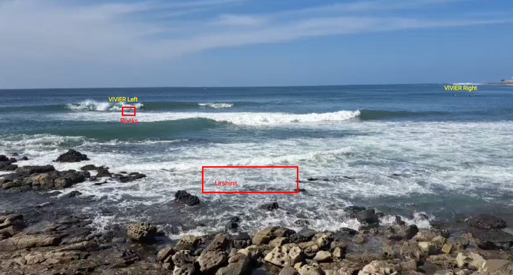

Ngor Right is a world-class reef break for intermediate to advanced surfers. Known for its flawless rights, it offers powerful and consistent waves. Pay attention to the reef and sea urchins. It can also get very crowded.

---

# Ngor Right

World-class reef break for intermediate to advanced surfers. Known for its flawless rights, it offers powerful and consistent waves. Pay attention to the reef and sea urchins. It can also get very crowded.

## Location

Located on the western tip of Ngor Island, just off the coast of Dakar, Senegal. Accessible by a short boat ride from the mainland.

## Best Time to Surf

The best time to surf Ngor Right is during the dry season, from November to April, when the swell is most consistent.

## Wave Characteristics

Ngor Right offers long, peeling right-hand waves that can reach up to 8 feet or

more during larger swells. The wave breaks over a shallow reef, creating fast and powerful sections.

## Crowd Factor

Ngor Right can get quite crowded, especially during peak surf season. It's advisable to arrive early to secure a good spot in the lineup.
Amenities
